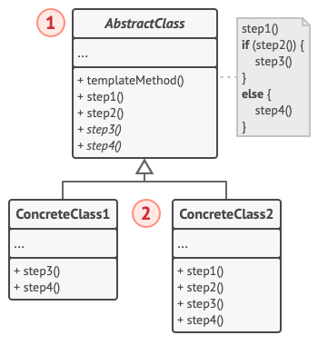

# Design Patterns Practice

This repository contains implementations of various design patterns in Java.

## Adapter Pattern

**Definition:** The Adapter pattern allows incompatible interfaces to work together by wrapping one interface around another.

**Description:** This implementation demonstrates the Adapter pattern by allowing an AudioPlayer interface to work with a WavSoundSystem through a WavAudioAdapter, enabling MP3 playback via WAV adaptation.

## Builder Pattern

**Definition:** The Builder pattern provides a way to construct complex objects step by step, allowing different representations using the same construction process.

**Description:** This example uses the Builder pattern to construct HttpRequest objects with optional parameters like URL, method, body, headers, timeout, and redirect settings in a fluent manner.

## Composite Pattern

**Definition:** The Composite pattern allows you to compose objects into tree structures to represent part-whole hierarchies, letting clients treat individual objects and compositions uniformly.

**Description:** No implementation provided in the codebase.

## Decorator Pattern

## Factory Method Pattern

**Definition:** The Factory Method pattern defines an interface for creating an object, but lets subclasses decide which class to instantiate.

**Description:** No implementation provided in the codebase.

## Observer Pattern

**Definition:** The Observer pattern defines a one-to-many dependency between objects so that when one object changes state, all its dependents are notified and updated automatically.

**Description:** This implementation shows the Observer pattern where a Channel notifies its Subscribers when data changes, maintaining a list of observers and calling their update methods.

## Proxy Pattern

**Definition:** The Proxy pattern provides a surrogate or placeholder for another object to control access to it.

**Description:** This example demonstrates the Proxy pattern with caching and security proxies that control access to a computation service, checking authorization and caching results.

## Strategy Pattern

**Definition:** The Strategy pattern defines a family of algorithms, encapsulates each one, and makes them interchangeable, allowing the algorithm to vary independently from clients that use it.

**Description:** This implementation uses the Strategy pattern to allow different payment methods (card or cash) to be selected at runtime for processing payments through a PaymentService.

## Template Method Pattern

**Definition:** The Template Method pattern defines the skeleton of an algorithm in a method, deferring some steps to subclasses, allowing subclasses to redefine certain steps without changing the algorithm's structure.

**Description:** This example illustrates the Template Method pattern where a base class defines the algorithm structure for performing computations, and subclasses provide specific implementations for parameters and computation logic.