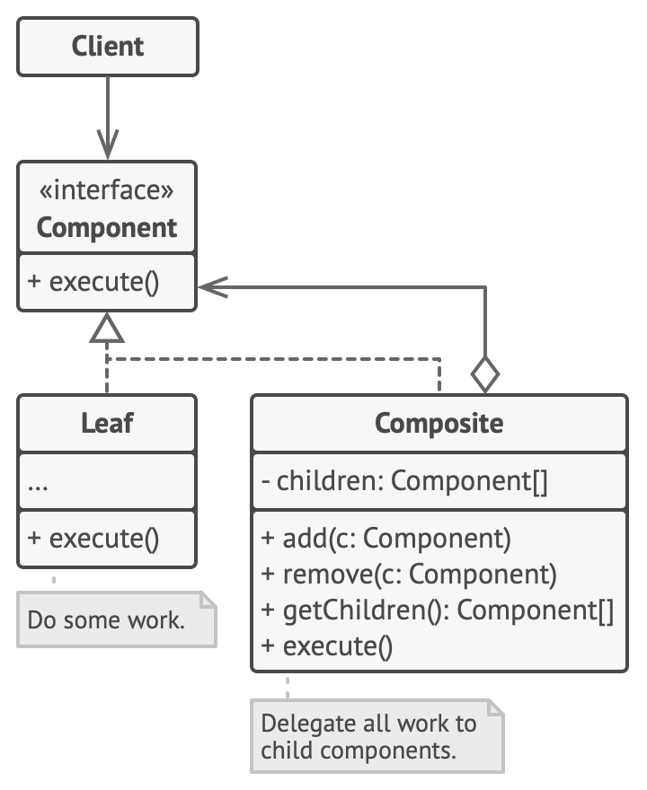

# Composite Design Pattern

Ce projet illustre l'implémentation du **design pattern Composite** en Java. Le pattern Composite permet de traiter de manière uniforme des objets individuels et des compositions d'objets.

## Structure du projet

- **Composant.java** : Définit l'interface commune pour tous les objets dans la composition.
- **Composite.java** : Implémente un conteneur qui peut contenir des objets enfants.
- **Element.java** : Implémente un objet simple qui ne peut pas contenir d'autres objets.
- **Main.java** : Contient le point d'entrée du programme et des exemples d'utilisation du pattern Composite.

## Description

Le pattern Composite est utile lorsque vous devez représenter des hiérarchies d'objets. Ce projet montre comment utiliser ce pattern pour gérer des objets simples et des groupes d'objets de manière uniforme.