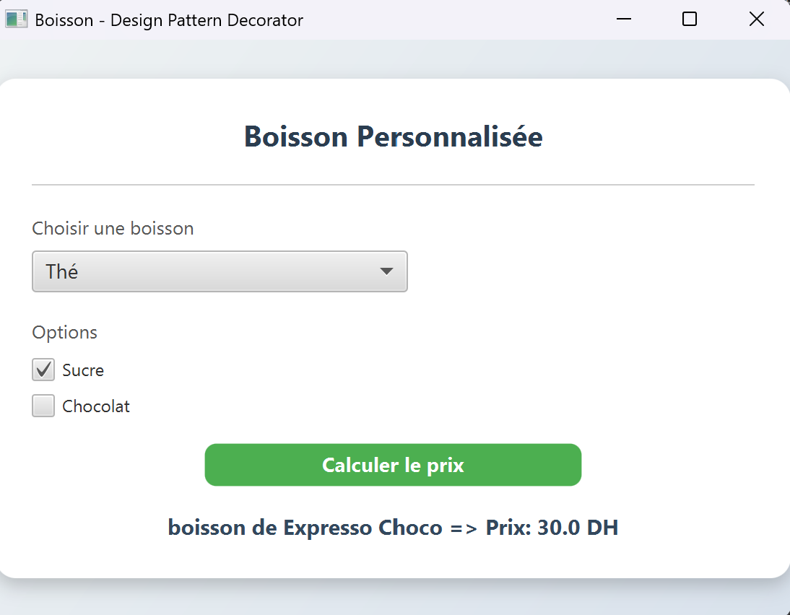

## Decorator Pattern

**Definition:** The Decorator pattern allows behavior to be added to an individual object, either statically or dynamically, without affecting the behavior of other objects from the same class.

**Description:** This JavaFX application demonstrates the Decorator pattern for beverages, allowing dynamic addition of ingredients like chocolate and caramel to base drinks like espresso, updating cost and description accordingly.

